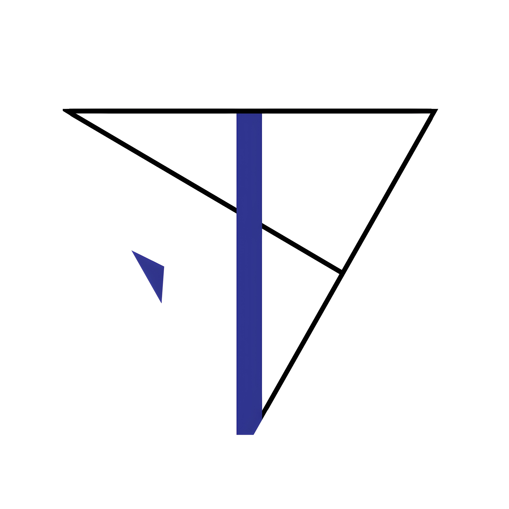
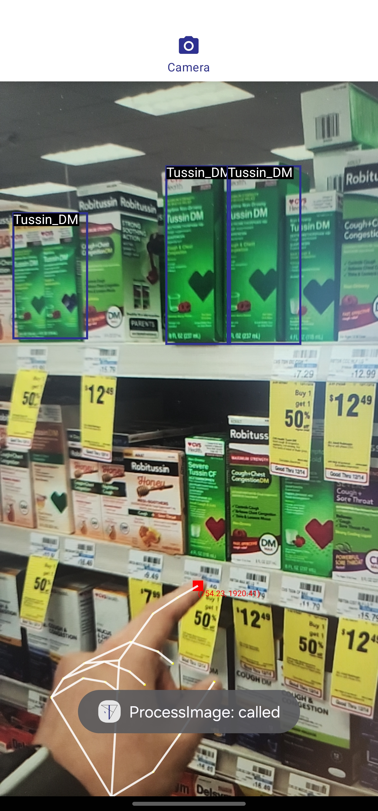
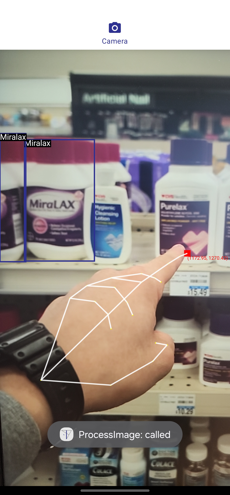
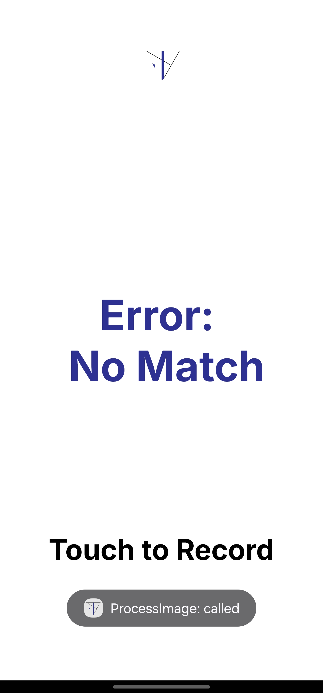
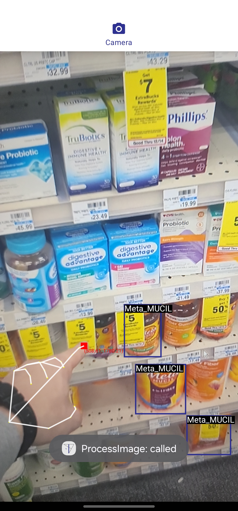

  
MEDi

## About the Project
Details

### Built With
[![TensorFlow Lite][TensorFlow]][TensorFlowLite-url]
[![Kotlin-l][Kotlin]][Kotlin-url]

## Download ⬇️
)

MEDi is currently having a beta testing process

## Screenshots 📱

  

## Permissions 🔒

Camera permission is required to proceed to the Medication Detection phase.

## Disclaimer

This program is free software: you can redistribute it and/or modify it under the terms of the GNU General Public License as published by the Free Software Foundation, either version 3 of the License, or (at your option) any later version.

This program is distributed in the hope that it will be useful, but WITHOUT ANY WARRANTY; without even the implied warranty of MERCHANTABILITY or FITNESS FOR A PARTICULAR PURPOSE. See the GNU General Public License for more details.

<!-- CONTACT -->
## Contact

Sungjoo Kim -  - email@example.com

Ethan Park -  - ethansjpark@gmail.com

Project Link: [https://github.com/2nd-Company/MEDi](https://github.com/your_username/repo_name](https://github.com/2nd-Company/MEDi)

(<a href="#readme-top">back to top</a>)

<!-- MARKDOWN LINKS & IMAGES -->
<!-- https://www.markdownguide.org/basic-syntax/#reference-style-links -->
[linkedin-shield]: (./doc/Icon/Linkedin.png)
[TensorFlow]: https://img.shields.io/badge/TensorFlow-%23FF6F00.svg?style=for-the-badge&logo=TensorFlow&logoColor=white
[TensorFlowLite-url]: https://nextjs.org/](https://ai.google.dev/edge/litert
[Kotlin]: https://img.shields.io/badge/kotlin-%237F52FF.svg?style=for-the-badge&logo=kotlin&logoColor=white
[Kotlin-url]: https://kotlinlang.org/
