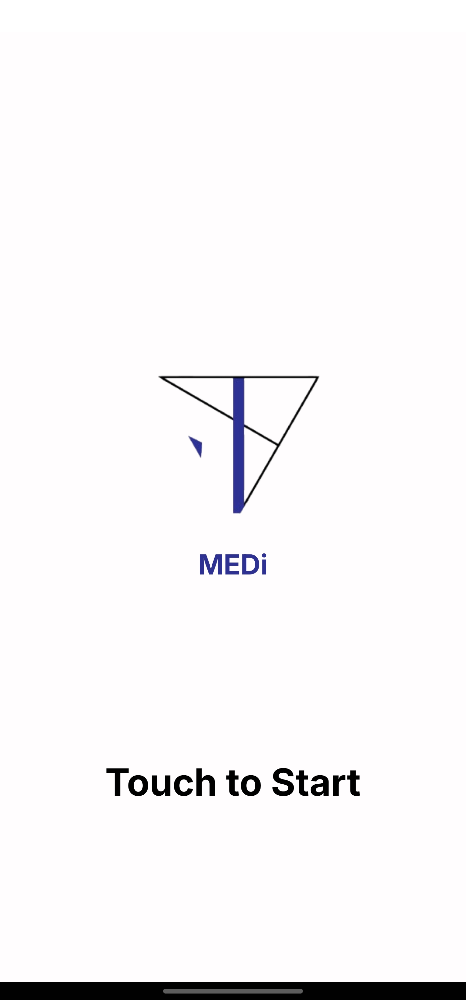

  
MEDi

## About the Project
Details

### Built With
*[![TensorFlow Lite][TensorFlow]][TensorFlowLite-url]
*[![Kotlin-l][Kotlin]][Kotlin-url]

## Download ⬇️
)

MEDi is currently having a beta testing process

## Screenshots 📱

  

<!-- PERMISSIONS -->
## Permissions 🔒

Camera permission is required to proceed to the Medication Detection phase.

<!-- CONTACT -->
## Contact

[Sungjoo Kim](https://github.com/junesjukim) - [![Linkedin][linkedin-shield]][linkedin-surl] - junesjukim@gmail.com

[Ethan Park](https://github.com/ethansjpark) - [![Linkedin][linkedin-shield]][linkedin-eurl] - ethansjpark@gmail.com

Project Link: [https://github.com/2nd-Company/MEDi](https://github.com/2nd-Company/MEDi)

https://github.com/junesjukim

<!-- MARKDOWN LINKS & IMAGES -->
<!-- https://www.markdownguide.org/basic-syntax/#reference-style-links -->
[linkedin-shield]: ./doc/Icon/Linkedin.png
[github-surl]: https://github.com/junesjukim
[github-eurl]: https://github.com/ethansjpark
[linkedin-surl]: https://www.linkedin.com/in/sungjoo-kim-june777
[linkedin-eurl]: https://www.linkedin.com/in/esjp/
[TensorFlow]: https://img.shields.io/badge/TensorFlow-%23FF6F00.svg?style=for-the-badge&logo=TensorFlow&logoColor=white
[TensorFlowLite-url]: https://nextjs.org/](https://ai.google.dev/edge/litert
[Kotlin]: https://img.shields.io/badge/kotlin-%237F52FF.svg?style=for-the-badge&logo=kotlin&logoColor=white
[Kotlin-url]: https://kotlinlang.org/
