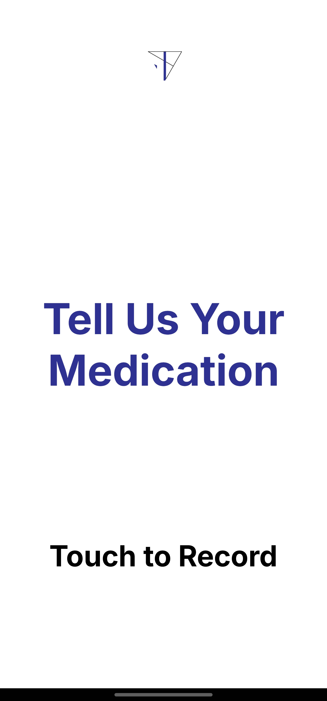

[![Contributors][contributors-shield]][contributors-url]
[![GitHub License][license-shield]][license-url]

  

  <h2>MEDi</h2>

AI-driven medication detection platform

## About the Project
Hello, we are a startup named **2nd Company**, creating an AI-driven platform designed to assist visually impaired individuals in safely and efficiently identifying pharmaceutical products in stores.

To prevent medication misuse and help users, we developed a way to guide pharmaceutical shopping effectively. In February 2025, we launched a platform called MEDi. 

**MEDi** provides step-by-step shopping guide agents by utilizing hand-tracking and object detection rather than broad assistance. For added convenience, we also offer audible recognition features, enabling users to navigate their shopping experience with ease and confidence.

The **MEDi**  team is constantly striving to improve and develop the platform, setting goals to provide accurate information and a user-friendly UI/UX. We are deeply committed to continually enhancing the environment for people who often remain in the shadows, ensuring they have access to tools that empower their daily lives.

### Built With
* [![TensorFlow Lite][TensorFlow]][TensorFlowLite-url]
* [![Kotlin-l][Kotlin]][Kotlin-url]

## Download ⬇️

MEDi is currently having a beta testing process.

## Screenshots 📱
<table align="center" style="background-color: #4c4c4c; padding: 20px; border-radius: 10px;">
  <tr>
    <td align="center" style="padding: 10px;">
      
    </td>
    <td align="center" style="padding: 10px;">
      
    </td>
    <td align="center" style="padding: 10px;">
      
    </td>
  </tr>
  <tr>
    <td align="center" style="padding: 10px;">
      
    </td>
    <td align="center" style="padding: 10px;">
      
    </td>
    <td align="center" style="padding: 10px;">
      
    </td>
  </tr>
</table>

<!-- PERMISSIONS -->
## Permissions 🔒

Camera permission is required to proceed to the Medication Detection phase.

## License
This repository has been created as a part of the ongoing development of the [MEDi](https://github.com/2nd-Company/MEDi) project.

The work in this repository is licensed under the [MIT](https://github.com/2nd-Company/MEDi/blob/main/LICENSE) license.

Copyright (c) 2025 2nd Company

<!-- CONTACT -->
## Contact

[Sungjoo Kim](https://github.com/junesjukim) -  - junesjukim@gmail.com

[Ethan Park](https://github.com/ethansjpark) -  - ethansjpark@gmail.com

Project Link: [https://github.com/2nd-Company/MEDi](https://github.com/2nd-Company/MEDi)

<!-- MARKDOWN LINKS & IMAGES -->
<!-- https://www.markdownguide.org/basic-syntax/#reference-style-links -->
[contributors-shield]: https://img.shields.io/github/contributors/2nd-Company/MEDi?style=for-the-badge&color=green
[contributors-url]: https://github.com/2nd-Company/MEDi/contributors
[license-shield]: https://img.shields.io/github/license/2nd-Company/Medi?style=for-the-badge
[license-url]: https://github.com/2nd-Company/MEDi/blob/main/LICENSE 
[linkedin-shield]: ./doc/Icon/Linkedin.png
[github-surl]: https://github.com/junesjukim
[github-eurl]: https://github.com/ethansjpark
[linkedin-surl]: https://www.linkedin.com/in/sungjoo-kim-june777
[linkedin-eurl]: https://www.linkedin.com/in/esjp/
[TensorFlow]: https://img.shields.io/badge/TensorFlow-%23FF6F00.svg?style=for-the-badge&logo=TensorFlow&logoColor=white
[TensorFlowLite-url]: https://nextjs.org/](https://ai.google.dev/edge/litert
[Kotlin]: https://img.shields.io/badge/kotlin-%237F52FF.svg?style=for-the-badge&logo=kotlin&logoColor=white
[Kotlin-url]: https://kotlinlang.org/
